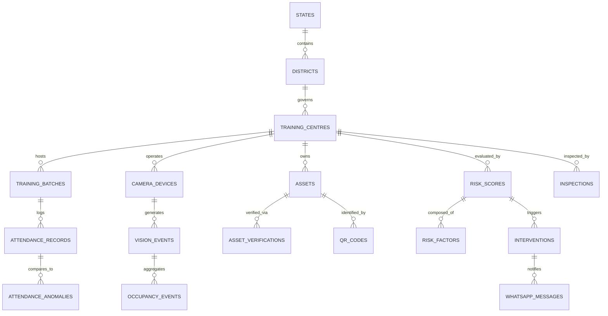

# SKILL-SENTINEL: Relational Database Schema & Data Dictionary

The platform uses a fully normalized, high-performance PostgreSQL database design with PostGIS geographic support, foreign key constraints, indexes, timestamps, soft-deletion flags, and auditability.

---

## 1. Entity Relationship Overview

---

## 2. Table Specifications

### 2.1 Governance & Geographic Hierarchy
1. **`states`**
   - `id` (VARCHAR(10) PK, e.g. 'IN-MH', 'IN-KA')
   - `name` (VARCHAR(100) NOT NULL UNIQUE)
   - `code` (VARCHAR(10) NOT NULL UNIQUE)
   - `created_at`, `updated_at` (TIMESTAMP)

2. **`districts`**
   - `id` (UUID PK)
   - `state_id` (VARCHAR(10) FK -> states.id)
   - `name` (VARCHAR(100) NOT NULL)
   - `code` (VARCHAR(20) NOT NULL)
   - `created_at`, `updated_at`

3. **`training_centres`**
   - `id` (UUID PK)
   - `centre_code` (VARCHAR(50) UNIQUE NOT NULL, e.g. 'TC-DEL-042')
   - `name` (VARCHAR(255) NOT NULL)
   - `district_id` (UUID FK -> districts.id)
   - `address` (TEXT)
   - `latitude`, `longitude` (DECIMAL(10, 7))
   - `contact_email`, `contact_phone` (VARCHAR(50))
   - `is_active` (BOOLEAN DEFAULT TRUE)
   - `current_risk_score` (DECIMAL(5, 2) DEFAULT 0.0)
   - `current_risk_level` (VARCHAR(20) DEFAULT 'LOW')
   - `created_at`, `updated_at`, `deleted_at`

### 2.2 Access Control & User Roles (RBAC)
4. **`roles`**
   - `id` (VARCHAR(50) PK, e.g. 'SUPER_ADMIN', 'NATIONAL_OFFICER', 'STATE_OFFICER', 'DISTRICT_OFFICER', 'INSPECTION_OFFICER', 'CENTRE_ADMIN')
   - `description` (VARCHAR(255))
   - `level` (INTEGER)

5. **`permissions`**
   - `id` (UUID PK)
   - `code` (VARCHAR(100) UNIQUE NOT NULL)
   - `module` (VARCHAR(50))
   - `description` (TEXT)

6. **`role_permissions`**
   - `role_id` (VARCHAR(50) FK -> roles.id)
   - `permission_id` (UUID FK -> permissions.id)

7. **`users`**
   - `id` (UUID PK)
   - `email` (VARCHAR(255) UNIQUE NOT NULL)
   - `hashed_password` (VARCHAR(255) NOT NULL)
   - `full_name` (VARCHAR(100) NOT NULL)
   - `role_id` (VARCHAR(50) FK -> roles.id)
   - `state_id` (VARCHAR(10) NULL FK -> states.id)
   - `district_id` (UUID NULL FK -> districts.id)
   - `centre_id` (UUID NULL FK -> training_centres.id)
   - `phone_number` (VARCHAR(20))
   - `is_active` (BOOLEAN DEFAULT TRUE)
   - `created_at`, `updated_at`

### 2.3 Academic & Attendance Data
8. **`courses`**
   - `id` (UUID PK)
   - `course_code` (VARCHAR(50) UNIQUE)
   - `title` (VARCHAR(255) NOT NULL)
   - `sector` (VARCHAR(100))
   - `duration_hours` (INTEGER)

9. **`training_batches`**
   - `id` (UUID PK)
   - `centre_id` (UUID FK -> training_centres.id)
   - `course_id` (UUID FK -> courses.id)
   - `batch_code` (VARCHAR(50) NOT NULL)
   - `start_date`, `end_date` (DATE)
   - `sanctioned_strength` (INTEGER NOT NULL)
   - `scheduled_start_time`, `scheduled_end_time` (TIME)
   - `classroom_id` (VARCHAR(50))
   - `is_active` (BOOLEAN DEFAULT TRUE)

10. **`trainees`**
    - `id` (UUID PK)
    - `batch_id` (UUID FK -> training_batches.id)
    - `enrolment_number` (VARCHAR(100) UNIQUE NOT NULL)
    - `anonymized_hash_id` (VARCHAR(64) UNIQUE NOT NULL)
    - `is_active` (BOOLEAN DEFAULT TRUE)

11. **`attendance_records`**
    - `id` (UUID PK)
    - `batch_id` (UUID FK -> training_batches.id)
    - `date` (DATE NOT NULL)
    - `source` (VARCHAR(30) DEFAULT 'BIOMETRIC_PORTAL')
    - `reported_present_count` (INTEGER NOT NULL)
    - `reported_absent_count` (INTEGER NOT NULL)
    - `submitted_at` (TIMESTAMP NOT NULL)

### 2.4 Video Telemetry & Aggregate Vision
12. **`camera_devices`**
    - `id` (UUID PK)
    - `centre_id` (UUID FK -> training_centres.id)
    - `device_name` (VARCHAR(100))
    - `room_type` (VARCHAR(50), e.g. 'CLASSROOM', 'LAB', 'RECEPTION')
    - `ip_address` (VARCHAR(45))
    - `stream_url` (VARCHAR(255))
    - `status` (VARCHAR(20) DEFAULT 'ONLINE')
    - `last_heartbeat_at` (TIMESTAMP)

13. **`camera_streams`**
    - `id` (UUID PK)
    - `camera_id` (UUID FK -> camera_devices.id)
    - `protocol` (VARCHAR(20) DEFAULT 'RTSP')
    - `resolution` (VARCHAR(20) DEFAULT '1080p')
    - `fps` (INTEGER DEFAULT 15)
    - `is_active` (BOOLEAN DEFAULT TRUE)

14. **`vision_events`**
    - `id` (UUID PK)
    - `camera_id` (UUID FK -> camera_devices.id)
    - `event_type` (VARCHAR(50) NOT NULL, e.g. 'AGGREGATE_DETECTION')
    - `timestamp` (TIMESTAMP NOT NULL INDEX)
    - `detected_persons_count` (INTEGER NOT NULL)
    - `confidence_score` (DECIMAL(4, 3))
    - `metadata_json` (JSONB)

15. **`occupancy_events`**
    - `id` (UUID PK)
    - `centre_id` (UUID FK -> training_centres.id)
    - `room_identifier` (VARCHAR(50))
    - `timestamp` (TIMESTAMP NOT NULL INDEX)
    - `headcount` (INTEGER NOT NULL)
    - `density_index` (DECIMAL(4, 2))

### 2.5 Asset Registry & Verification
16. **`asset_categories`**
    - `id` (UUID PK)
    - `name` (VARCHAR(100) NOT NULL)
    - `code` (VARCHAR(50) UNIQUE NOT NULL)
    - `minimum_required_per_batch` (INTEGER DEFAULT 1)

17. **`assets`**
    - `id` (UUID PK)
    - `centre_id` (UUID FK -> training_centres.id)
    - `category_id` (UUID FK -> asset_categories.id)
    - `asset_tag` (VARCHAR(100) UNIQUE NOT NULL)
    - `serial_number` (VARCHAR(100))
    - `model_name` (VARCHAR(100))
    - `status` (VARCHAR(30) DEFAULT 'VERIFIED_PRESENT')
    - `specifications` (JSONB)

18. **`qr_codes`**
    - `id` (UUID PK)
    - `asset_id` (UUID FK -> assets.id UNIQUE)
    - `qr_payload` (TEXT NOT NULL)
    - `digital_signature` (VARCHAR(255) NOT NULL)
    - `generated_at` (TIMESTAMP NOT NULL)

19. **`asset_verifications`**
    - `id` (UUID PK)
    - `asset_id` (UUID FK -> assets.id)
    - `verified_by_user_id` (UUID FK -> users.id)
    - `verification_method` (VARCHAR(30) DEFAULT 'QR_SCAN')
    - `latitude`, `longitude` (DECIMAL(10, 7))
    - `is_verified` (BOOLEAN DEFAULT TRUE)
    - `notes` (TEXT)
    - `verified_at` (TIMESTAMP NOT NULL)

### 2.6 Anomalies & Risk Intelligence
20. **`attendance_anomalies`**
    - `id` (UUID PK)
    - `centre_id` (UUID FK -> training_centres.id)
    - `batch_id` (UUID FK -> training_batches.id)
    - `detected_at` (TIMESTAMP NOT NULL INDEX)
    - `reported_attendance` (INTEGER NOT NULL)
    - `observed_headcount` (INTEGER NOT NULL)
    - `discrepancy_percentage` (DECIMAL(5, 2) NOT NULL)
    - `severity` (VARCHAR(20) DEFAULT 'HIGH')
    - `status` (VARCHAR(30) DEFAULT 'OPEN')

21. **`infrastructure_anomalies`**
    - `id` (UUID PK)
    - `centre_id` (UUID FK -> training_centres.id)
    - `asset_id` (UUID NULL FK -> assets.id)
    - `detected_at` (TIMESTAMP NOT NULL)
    - `anomaly_type` (VARCHAR(50), e.g. 'ASSET_MISSING', 'CAMERA_TAMPERING')
    - `severity` (VARCHAR(20) DEFAULT 'MODERATE')
    - `details` (TEXT)

22. **`risk_scores`**
    - `id` (UUID PK)
    - `centre_id` (UUID FK -> training_centres.id INDEX)
    - `computed_at` (TIMESTAMP NOT NULL INDEX)
    - `overall_score` (DECIMAL(5, 2) NOT NULL)
    - `risk_level` (VARCHAR(20) NOT NULL, e.g. 'LOW', 'MODERATE', 'HIGH', 'CRITICAL')
    - `trend` (VARCHAR(20) DEFAULT 'INCREASING')

23. **`risk_factors`**
    - `id` (UUID PK)
    - `risk_score_id` (UUID FK -> risk_scores.id)
    - `factor_type` (VARCHAR(50) NOT NULL, e.g. 'ATTENDANCE_MISMATCH', 'EQUIPMENT_DEFICIT')
    - `weight` (DECIMAL(3, 2))
    - `score_contribution` (DECIMAL(5, 2))
    - `explanation` (TEXT NOT NULL)

### 2.7 Interventions & Governance Actions
24. **`interventions`**
    - `id` (UUID PK)
    - `centre_id` (UUID FK -> training_centres.id)
    - `risk_score_id` (UUID NULL FK -> risk_scores.id)
    - `type` (VARCHAR(50) NOT NULL, e.g. 'PHYSICAL_INSPECTION', 'SHOW_CAUSE_NOTICE', 'FUND_FREEZE')
    - `status` (VARCHAR(30) DEFAULT 'RECOMMENDED')
    - `recommended_action` (TEXT NOT NULL)
    - `assigned_to_user_id` (UUID NULL FK -> users.id)
    - `created_at`, `resolved_at` (TIMESTAMP)

25. **`inspections`**
    - `id` (UUID PK)
    - `centre_id` (UUID FK -> training_centres.id)
    - `intervention_id` (UUID NULL FK -> interventions.id)
    - `inspection_type` (VARCHAR(50) DEFAULT 'SURPRISE_AUDIT')
    - `status` (VARCHAR(30) DEFAULT 'ASSIGNED')
    - `scheduled_date` (DATE)
    - `completed_at` (TIMESTAMP)
    - `officer_findings` (TEXT)

26. **`inspection_assignments`**
    - `id` (UUID PK)
    - `inspection_id` (UUID FK -> inspections.id)
    - `officer_id` (UUID FK -> users.id)
    - `assigned_by_user_id` (UUID FK -> users.id)
    - `assigned_at` (TIMESTAMP)

27. **`inspection_evidence`**
    - `id` (UUID PK)
    - `inspection_id` (UUID FK -> inspections.id)
    - `evidence_type` (VARCHAR(30) DEFAULT 'IMAGE_PRIVACY_MASKED')
    - `file_url` (VARCHAR(500) NOT NULL)
    - `hash_sha256` (VARCHAR(64) NOT NULL)
    - `uploaded_at` (TIMESTAMP NOT NULL)

### 2.8 Notifications, Alerts & Audit Logs
28. **`notifications`**
    - `id` (UUID PK)
    - `user_id` (UUID FK -> users.id)
    - `title` (VARCHAR(200) NOT NULL)
    - `message` (TEXT NOT NULL)
    - `level` (VARCHAR(20) DEFAULT 'INFO')
    - `is_read` (BOOLEAN DEFAULT FALSE)
    - `created_at` (TIMESTAMP NOT NULL)

29. **`whatsapp_messages`**
    - `id` (UUID PK)
    - `recipient_phone` (VARCHAR(20) NOT NULL)
    - `message_body` (TEXT NOT NULL)
    - `centre_id` (UUID FK -> training_centres.id)
    - `status` (VARCHAR(20) DEFAULT 'SENT')
    - `dispatched_at` (TIMESTAMP NOT NULL)

30. **`audit_logs`**
    - `id` (UUID PK)
    - `user_id` (UUID NULL FK -> users.id)
    - `action` (VARCHAR(100) NOT NULL)
    - `entity_type` (VARCHAR(50) NOT NULL)
    - `entity_id` (VARCHAR(100))
    - `ip_address` (VARCHAR(45))
    - `timestamp` (TIMESTAMP NOT NULL INDEX)
    - `details` (JSONB)

31. **`system_alerts`**
    - `id` (UUID PK)
    - `alert_type` (VARCHAR(50))
    - `severity` (VARCHAR(20) DEFAULT 'WARNING')
    - `message` (TEXT)
    - `is_acknowledged` (BOOLEAN DEFAULT FALSE)
    - `created_at` (TIMESTAMP)

32. **`maintenance_records`**
    - `id` (UUID PK)
    - `camera_id` (UUID NULL FK -> camera_devices.id)
    - `asset_id` (UUID NULL FK -> assets.id)
    - `issue_description` (TEXT)
    - `status` (VARCHAR(30) DEFAULT 'PENDING')
    - `logged_at` (TIMESTAMP)
